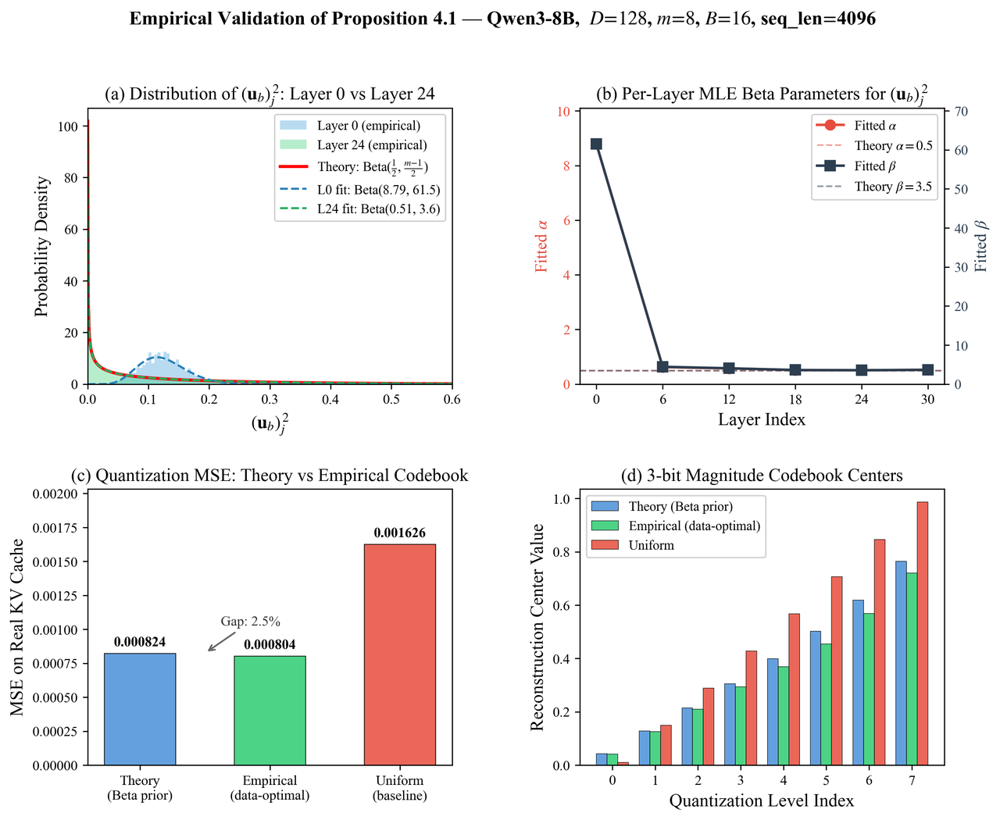

# Memory, Quantization, and Beta-Prior Validation

## 1. Comprehensive KV Cache Memory Usage Analysis

We do not find the 4-bit Key cache to be a burden in practice. In fact, it is the main reason ParisKV is memory-efficient. The key difference from full attention is that we only store **Keys (not Values)** and store them in **4-bit precision**. As a result, the per-token memory drops from 4096B (bf16 K+V) to 512B for the Key cache. Even including all additional components, the total memory is about 556.5B per token, which is only ~13.6% of full KV.

### Per-token memory accounting

| Component | Per-token-per-layer Storage | Ratio vs Full Attention |
|---|---:|---:|
| Full Attention (bf16 K+V) | 4096 B | 100% |
| 4-bit Key Cache (Key only) | 512 B | 12.5% |
| ParisKV equivalent (all components) | 556.5 B | 13.6% |

Thus, the 4-bit Key cache reduces storage to **1/8 of full attention**:
- **4×** from quantization (16-bit → 4-bit),
- **2×** from storing only K instead of K+V.

### Scaling with concurrent requests

We measure KV cache memory on Qwen3-8B (32K context) while increasing the number of concurrent requests (batch size).

| Batch | Full (GB) | ParisKV (GB) | Savings |
|---|---:|---:|---:|
| 1  | 4.50  | 0.61  | 86.4% |
| 4  | 18.00 | 2.45  | 86.4% |
| 8  | 36.00 | 4.89  | 86.4% |
| 16 | 72.00 | 9.78  | 86.4% |
| 32 | 144.00 | 19.56 | 86.4% |
| 64 | 288.00 | 39.13 | 86.4% |

---

## 2. Empirical Validation of the SRHT-Induced Beta Prior

### Setup

We extract KV tensors from Qwen3-8B, apply the same SRHT used in our method (seed=42), split into 8D blocks, normalize, and fit Beta distributions to $(u_j)^2$ via MLE.

### Finding 1: Beta shape is empirically confirmed

Layers 6–30 match the theoretical \(\mathrm{Beta}(0.5, 3.5)\) closely. Early layers deviate more because they retain stronger directional structure, which a single SRHT round does not fully isotropize.

| Layer | Fitted α | Fitted β | KS Stat |
|---|---:|---:|---:|
| L0  | 8.787 | 61.503 | 0.449 |
| L6  | 0.624 | 4.445 | 0.071 |
| L12 | 0.575 | 4.054 | 0.048 |
| L18 | 0.515 | 3.617 | 0.012 |
| L24 | 0.508 | 3.560 | 0.007 |
| L30 | 0.521 | 3.674 | 0.015 |
| Theory | 0.500 | 3.500 | — |

### Finding 2: The theory-based codebook is near-optimal on real data

We compare three codebooks:
- theory-based Beta prior
- empirical data-optimal codebook
- uniform spacing

| Codebook | MSE on Real Data | Gap to Optimal |
|---|---:|---:|
| Theory (Beta prior) | 0.000824 | +2.5% |
| Empirical (data-optimal) | 0.000804 | 0% |
| Uniform | 0.001626 | +102% |

The Beta prior is used to capture the **shape** of the distribution rather than exact per-layer parameters. Empirically, SRHT consistently induces a right-skewed, near-zero–concentrated distribution (Fig. below), which is sufficient for quantizer design.

.

In practice, the theory-based codebook is only **2.5% worse** than the data-optimal one, while a uniform baseline is over **2× worse**. 

This shows that matching the exact distribution is unnecessary—capturing the correct shape already yields **near-optimal 3-bit quantization** without any data-dependent tuning.

